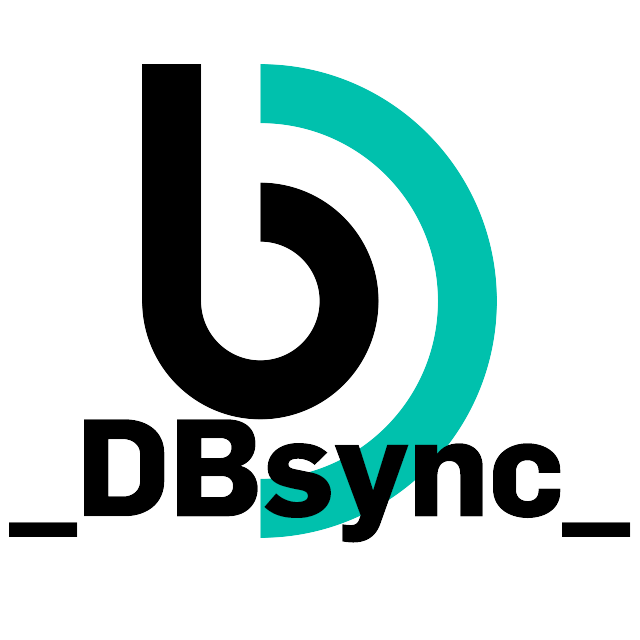

<p align="center">
  
</p>

# DB Sync
`_DBsync_` is a PHP application designed to synchronize academic data—specifically student registrations and grades—between multiple database systems. It orchestrates data flows between Moodle (PlataformAbERTA), WISEflow, a central integration database (BDInt - MySQL), and the university's main academic management system (SiGES - Oracle).

It was originally developed for [Universidade Aberta (UAb)](https://portal.uab.pt/).

## 1. Core Features

`_DBsync_` can be executed both from the Command-Line Interface (CLI) for automated tasks (e.g., cron jobs) and from a web browser, which provides a rich, real-time monitoring dashboard.

### Key Functionalities:
*   **Automated Monitoring & Alerts**: The script checks its own execution schedule. If it fails to run within an expected timeframe, it automatically sends an email alert to system administrators, ensuring high availability and quick-response to failures.
*   **Dual-Mode Execution**:
    *   **CLI Mode**: Outputs plain text logs, suitable for cron jobs and server-side execution.
    *   **Browser Mode**: Renders a dynamic HTML dashboard displaying the status of the last synchronization, real-time progress bars for each task, and detailed results of the operations performed.
*   **Modular Synchronization Tasks**: The application is broken down into distinct, independent modules, each responsible for a specific data synchronization task. This makes the system easier to debug and maintain.

### Synchronization Modules
The script performs a series of sequential data synchronization tasks:

1.  **Evaluation Registration Sync (`REG.AVALIAÇÃO`)**:
    *   Synchronizes the evaluation method (e.g., Continuous Assessment vs. Final Exam) chosen by students.
    *   Reads student choices from a Moodle web service and the `BDInt` database.
    *   Creates or updates student assessment records in the `SiGES` (Oracle) academic system to reflect their chosen evaluation type.
    *   Handles different assessment periods (Normal, Re-sit).

2.  **Absenteeism Sync (`ABSENTISMO`)**:
    *   Identifies students who are marked as absent for Final Assessment or Continuous Assessment with an exam.
    *   Updates the student's evaluation status in the `BDInt` database to reflect their absence.

3.  **Failed Grades Sync (`REPROVADOS`)**:
    *   Processes failed grades for both Continuous and Final Assessment types.
    *   Synchronizes numeric grades below the passing threshold from `BDInt` to the `SiGES` system.
    *   Handles special cases like "Not Applicable" (N/A) grades.

4.  **Passed Grades Sync (`APROVADOS`)**:
    *   Synchronizes passing grades (>= 10) from `BDInt` to `SiGES`.
    *   Updates the student's record in `BDInt` to mark the grade as successfully synchronized.

5.  **Re-sit Eligibility (`RECURSO`)**:
    *   Identifies students who have failed an assessment but are eligible for a re-sit exam.
    *   Updates their status in `BDInt` to enable their registration in the re-sit period.

6.  **Grade Improvement Sync (`MELHORIAS EM RECURSO`)**:
    *   Identifies students registered in `SiGES` for grade improvement during the re-sit period.
    *   Enrolls these students into the corresponding assessment flow in WISEflow by creating an entry in the `wiseflow.flows_assess` table.

7.  **Special Season Sync (`ÉPOCA ESPECIAL`)**:
    *   Manages student enrollments for the special assessment season.
    *   Identifies registered students in `SiGES` and enrolls them in the correct WISEflow assessment flow.

## 2. Architecture & Components

### `_DBsync_.php`
This is the main executable file. It contains all the business logic for the synchronization tasks, database queries, and conditional rendering for CLI or browser environments.

### `auth_lib_dbs.php` (Not provided, inferred)
This file is responsible for establishing and managing database connections. It should contain functions to connect to:
*   **BDInt**: The central MySQL integration database.
*   **SiGES**: The main Oracle-based academic management system.
*   **Moodle/PlataformAbERTA**: A Moodle database or web service endpoint.

### `functions.js`
This file contains the client-side JavaScript logic for the browser-based dashboard. Its responsibilities likely include:
*   Rendering and updating progress bars (`progressbar.js`).
*   Displaying titles and results with fade-in animations.
*   Managing the timing and sequence of UI updates to correspond with the backend process.

### `styles.css`
This CSS file defines the visual appearance of the web dashboard. It includes:
*   A responsive layout that adjusts for different screen sizes.
*   Custom fonts (`Audiowide`) and styling for all UI components (logo, tables, progress bars, etc.).
*   A "fade-in" effect for displaying results sequentially.
*   A gradient overlay at the top of the results section to blend with the fixed header.

## 3. Setup and Execution

### Prerequisites
*   PHP environment (version 7+ recommended).
*   Access to MySQL and Oracle databases.
*   Required PHP extensions: `mysqli` for MySQL and `oci8` for Oracle.
*   PHPMailer library for email notifications.

### Configuration
1.  **`auth_lib_dbs.php`**: Create this file from its template and fill in the database credentials for MySQL (BDInt) and Oracle (SiGES), as well as any necessary Moodle web service tokens or URLs.
2.  **PHPMailer**: Ensure the path to the PHPMailer library in `_DBsync_.php` is correct for your server environment.
3.  **Email Settings**: Configure the SMTP server details, sender, and recipient email addresses within `_DBsync_.php`.

### Execution
*   **CLI**:
    ```bash
    php _DBsync_.php
    ```
*   **Browser**:
    Place the project files in a web-accessible directory on your server and navigate to `_DBsync_.php` in your browser.

*   **Scheduled Task (Cron Job)**:
    To enable automated execution and monitoring, set up a cron job to run the script via CLI at regular intervals (e.g., every 30 minutes).
    ```cron
    */30 * * * * /usr/bin/php /path/to/your/project/_DBsync_.php
    ```

## License

**Author**: Bruno Tavares  
**Contact**: [brunustavares@gmail.com](mailto:brunustavares@gmail.com)  
**LinkedIn**: [https://www.linkedin.com/in/brunomastavares/](https://www.linkedin.com/in/brunomastavares/)  
**Copyright**: 2024-2025 Bruno Tavares  
**License**: GNU GPL v3 or later  

This program is free software: you can redistribute it and/or modify it under the terms of the GNU General Public License as published by the Free Software Foundation, either version 3 of the License, or (at your option) any later version.

This program is distributed in the hope that it will be useful, but WITHOUT ANY WARRANTY; without even the implied warranty of MERCHANTABILITY or FITNESS FOR A PARTICULAR PURPOSE. See the GNU General Public License for more details.

You should have received a copy of the GNU General Public License along with this program. If not, see <https://www.gnu.org/licenses/>.

### Assets

- **Source code**: GNU GPL v3 or later (© Bruno Tavares)  
- **Images**: © Universidade Aberta, provided by the Digital Production Services, all rights reserved. Usage subject to the institution's policy.
